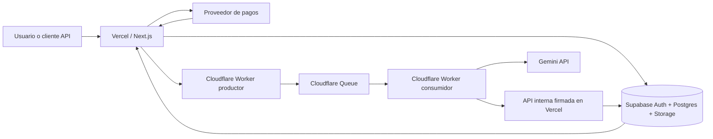
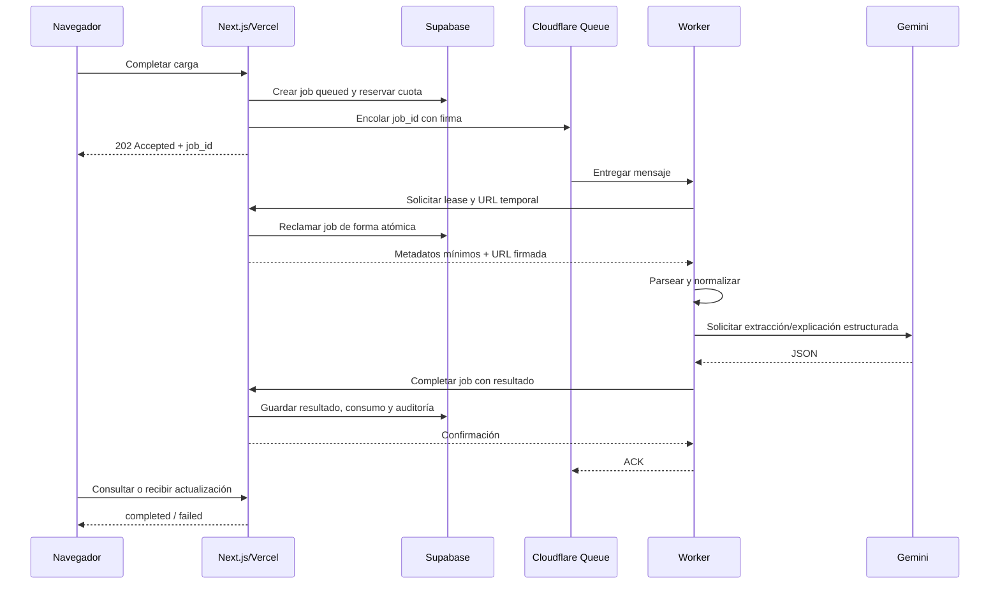

# Arquitectura técnica de KRONOVA

**Versión:** 1.0

**Fecha:** 1 de agosto de 2026

**Estado:** Aprobada como arquitectura objetivo para la Fase 1

## 1. Objetivo

Definir una arquitectura serverless, multiempresa y extensible para KRONOVA antes de diseñar la base de datos. La primera implementación productiva será DocAudit Colombia, pero los límites entre componentes permitirán incorporar LeaseReader, ReviewSync, otros países, nuevos modelos de IA y proveedores de pago sin reconstruir el núcleo del SaaS.

## 2. Principios

1. Supabase será la única fuente de verdad para identidad, organizaciones, consumo, documentos, trabajos y suscripciones.
2. Ningún documento empresarial viajará en mensajes de cola; las colas transportarán identificadores.
3. Los procesos largos serán asíncronos, idempotentes y reintentables.
4. El navegador nunca recibirá secretos de Supabase, Gemini, Stripe, Mercado Pago o Cloudflare.
5. Toda consulta de negocio estará asociada explícitamente a una organización.
6. La autorización dependerá de la base de datos y RLS, no de datos enviados por el cliente.
7. Las reglas fiscales estarán separadas por país, versión y fecha de vigencia.
8. La IA explicará y clasificará; los cálculos y validaciones objetivas serán deterministas.
9. Pagos e IA se consumirán mediante adaptadores para evitar dependencia irreversible de un proveedor.
10. Se comenzará con el mínimo número de servicios y Cloudflare se activará cuando se implemente el pipeline asíncrono.

## 3. Vista general



## 4. Responsabilidades por plataforma

### 4.1 Next.js en Vercel

Será la aplicación web y la capa Backend-for-Frontend.

Responsabilidades:

- Landing, autenticación y dashboard.
- Localización de interfaz y selección de idioma.
- Validación de sesión y organización activa.
- Endpoints públicos de la aplicación.
- Creación de URLs firmadas para carga y descarga.
- Creación transaccional de documentos y trabajos.
- Consultas rápidas del historial y resultados.
- Inicio de checkout y portal de facturación.
- Recepción y validación de webhooks de pago.
- API interna firmada utilizada por los workers.
- Generación de reportes descargables cuando sea una operación corta.

No será responsable de:

- Mantener peticiones abiertas durante OCR o análisis de IA.
- Ejecutar reintentos de trabajos largos.
- Guardar archivos en el filesystem efímero.
- Actuar como fuente de verdad de suscripciones.

### 4.2 Supabase

Será la plataforma de datos y la fuente de verdad.

Responsabilidades:

- Auth: usuarios, sesiones, recuperación y proveedores de identidad futuros.
- Postgres: organizaciones, miembros, planes, suscripciones, documentos, trabajos, resultados, consumo, alertas y auditoría.
- RLS: separación estricta entre organizaciones.
- Storage privado: originales y artefactos derivados.
- Realtime o consulta periódica: actualización del estado de trabajos en el dashboard.
- Migraciones SQL versionadas.
- Funciones SQL transaccionales para operaciones críticas como reservar cuota o reclamar un trabajo.

La clave `service_role` se conservará únicamente en entornos de servidor controlados. En la primera versión permanecerá en Vercel; el Worker de Cloudflare no tendrá acceso directo a ella.

### 4.3 Cloudflare Workers y Queues

Se incorporarán en la tarea del pipeline asíncrono, no durante la creación inicial de tablas.

Responsabilidades:

- Recibir una solicitud firmada de Vercel para encolar un `job_id`.
- Publicar trabajos en Cloudflare Queues.
- Consumir trabajos con concurrencia controlada.
- Aplicar reintentos, demoras y Dead Letter Queue.
- Ejecutar parsing, normalización, OCR remoto e invocaciones a Gemini.
- Reportar progreso, resultado o error mediante la API interna de Vercel.

Restricciones:

- El mensaje contendrá `job_id`, versión y un identificador de trazabilidad; nunca texto documental, credenciales o datos personales.
- El consumidor debe tolerar entrega repetida.
- Cloudflare guardará solamente secretos de firma e integraciones necesarias para procesar.
- El Worker solicitará a Vercel una URL temporal para leer el archivo y no recibirá `SUPABASE_SERVICE_ROLE_KEY`.

### 4.4 Gemini

Responsabilidades:

- Extracción asistida cuando el parser determinista no sea suficiente.
- Clasificación de hallazgos.
- Resumen y explicación en el idioma solicitado.
- Salida validada mediante esquemas JSON versionados.

No será responsable de:

- Autorizar usuarios.
- Calcular cuotas o cobros.
- Determinar por sí solo el cumplimiento legal definitivo.
- Ser la única fuente para operaciones aritméticas o reglas DIAN.

## 5. Flujos síncronos

Los flujos síncronos deben completar normalmente en pocos segundos y no depender de trabajos largos.

### Lectura del dashboard

```text
Navegador → Next.js → validar sesión → consultar Supabase con RLS → respuesta
```

### Creación de carga

```text
Navegador → POST /api/v1/uploads
Next.js → valida usuario, organización, plan, cuota, nombre, MIME y tamaño
Next.js → crea documento pendiente y URL firmada
Navegador → carga directamente a Supabase Storage
Navegador → POST /api/v1/uploads/{documentId}/complete
```

La carga binaria no pasará por una función de Vercel salvo que una validación futura lo requiera.

### Consulta de estado

```text
Navegador → GET /api/v1/jobs/{jobId}
Next.js → Supabase/RLS → estado y progreso
```

Realtime podrá sustituir el polling después de comprobar que simplifica la experiencia sin debilitar autorización.

## 6. Flujo asíncrono documental



### Estados del trabajo

```text
queued → processing → completed
                   ↘ retrying → processing
                   ↘ failed
queued/processing → canceled
```

### Idempotencia

- Cada trabajo tendrá UUID y clave idempotente.
- La reserva de cuota y creación del trabajo ocurrirán en una transacción.
- Reclamar un trabajo será una operación atómica con lease y vencimiento.
- Un resultado completado no podrá sobrescribirse por un reintento tardío.
- Los webhooks y callbacks tendrán identificador externo único.
- Los reintentos técnicos no consumirán una segunda unidad de cuota.

### Fallos

- Errores transitorios: reintento con backoff.
- Archivo inválido o regla no compatible: fallo definitivo sin reintento.
- Mensajes agotados: Dead Letter Queue y alerta.
- Lease vencido: otro consumidor podrá recuperar el trabajo.
- Respuesta inválida de IA: reintento limitado y registro de versión de esquema.

## 7. Estructura propuesta del repositorio

```text
docs/
  ARCHITECTURE.md
  MVP-SCOPE-COLOMBIA.md
  adr/
src/
  app/
    (marketing)/
    (auth)/
    dashboard/
    api/v1/
      uploads/
      documents/
      jobs/
      billing/
      webhooks/
      internal/jobs/
  components/
  lib/
    client/
    server/
      auth/
      db/
      storage/
      jobs/
      billing/
      ai/
      security/
    schemas/
    i18n/
  modules/
    docaudit/
      colombia/
        rules/
        schemas/
        prompts/
    leasereader/
    reviewsync/
supabase/
  migrations/
  seed.sql
workers/
  document-processor/
    src/
    wrangler.jsonc
```

No se moverán todos los archivos actuales de inmediato. La estructura se adoptará gradualmente cuando cada área tenga implementación real.

## 8. Endpoints objetivo

### Autenticados para usuarios

| Método | Endpoint | Responsabilidad |
|---|---|---|
| `POST` | `/api/v1/uploads` | Crear registro y URL firmada de carga |
| `POST` | `/api/v1/uploads/{id}/complete` | Confirmar carga y crear trabajo |
| `GET` | `/api/v1/documents` | Historial paginado del tenant |
| `GET` | `/api/v1/documents/{id}` | Documento y resultado autorizado |
| `DELETE` | `/api/v1/documents/{id}` | Solicitar eliminación |
| `GET` | `/api/v1/jobs/{id}` | Estado y progreso |
| `POST` | `/api/v1/jobs/{id}/retry` | Reintento autorizado |
| `POST` | `/api/v1/billing/checkout` | Crear checkout con proveedor elegido |
| `POST` | `/api/v1/billing/portal` | Abrir gestión de suscripción cuando exista |
| `GET` | `/api/v1/billing/usage` | Consumo y límites del periodo |

### Webhooks externos

| Método | Endpoint | Responsabilidad |
|---|---|---|
| `POST` | `/api/v1/webhooks/stripe` | Eventos Stripe firmados |
| `POST` | `/api/v1/webhooks/mercado-pago` | Eventos Mercado Pago validados |

### Internos

| Método | Endpoint | Responsabilidad |
|---|---|---|
| `POST` | `/api/v1/internal/jobs/{id}/lease` | Reclamar trabajo y obtener URL temporal |
| `POST` | `/api/v1/internal/jobs/{id}/progress` | Actualizar progreso limitado |
| `POST` | `/api/v1/internal/jobs/{id}/complete` | Persistir resultado validado |
| `POST` | `/api/v1/internal/jobs/{id}/fail` | Registrar fallo normalizado |

Los endpoints internos exigirán firma HMAC, timestamp, nonce, protección contra replay y rotación de secreto. No serán invocables mediante una sesión normal de usuario.

## 9. Arquitectura de pagos para Colombia

### Hallazgo de disponibilidad

Stripe no lista actualmente a Colombia como país soportado para abrir una cuenta local de pagos. La cuenta existente debe revisarse antes de integrarla: país registrado, entidad legal, cuenta bancaria de liquidación, monedas y capacidades activas. Tener acceso al Dashboard o modo de prueba no demuestra que una sociedad colombiana pueda cobrar y retirar fondos en producción.

### Decisión

La aplicación usará una interfaz interna `BillingProvider` y nunca guardará reglas de acceso directamente en objetos específicos de Stripe o Mercado Pago.

```ts
interface BillingProvider {
  createCheckout(input: CheckoutInput): Promise<CheckoutResult>
  createPortal?(input: PortalInput): Promise<PortalResult>
  verifyWebhook(request: Request): Promise<NormalizedBillingEvent>
  cancelSubscription(externalId: string): Promise<void>
}
```

### Proveedores

1. **Mercado Pago Colombia — candidato principal para el lanzamiento local.** Dispone de suscripciones, planes, reintentos y medios locales. Debe validarse en sandbox qué métodos permiten renovación verdaderamente automática para el tipo de cuenta.
2. **Stripe — proveedor internacional secundario.** Se utilizará solo si la cuenta está vinculada legítimamente a una entidad de un país soportado y sus capacidades de producción están activas.
3. **Wompi — opción posterior para pagos locales o paquetes de documentos.** Ofrece tarjetas, PSE, Nequi y Botón Bancolombia; no se adoptará como motor principal de suscripciones hasta confirmar por contrato y pruebas el comportamiento recurrente requerido.

### Métodos de pago

- Suscripción automática: tarjeta o medio guardado que el proveedor confirme como reutilizable y habilitado para cobro recurrente.
- PSE, Nequi, Efecty o transferencia: pago inicial, renovación manual o compra de paquetes cuando no exista mandato recurrente verificable.
- Nunca se marcará una suscripción como activa por el retorno del navegador.
- Solo un webhook válido, idempotente y persistido podrá activar o renovar acceso.

### Fuente de verdad de facturación

Supabase guardará el estado normalizado:

```text
trialing | active | past_due | paused | canceled | expired
```

Cada registro conservará `provider`, `external_customer_id`, `external_subscription_id`, moneda, precio, periodo, estado y fecha del último evento. Los payloads completos de webhooks tendrán retención limitada y datos sensibles minimizados.

### Moneda

- Colombia: catálogo en COP antes del lanzamiento.
- Internacional: USD cuando el proveedor y la entidad comercial lo permitan.
- El precio aprobado en USD de la Tarea 01 es referencia comercial; la conversión a COP será una decisión versionada, no una conversión diaria automática.

## 10. Seguridad entre servicios

- TLS obligatorio.
- Secretos separados por desarrollo, staging y producción.
- HMAC sobre método, ruta, timestamp, nonce y hash del cuerpo.
- Ventana corta de aceptación y almacenamiento temporal de nonces.
- Service role solo en Vercel durante el MVP.
- URLs de Storage de corta duración y asociadas al job reclamado.
- Validación de esquema en cada frontera.
- Logs sin texto documental, tokens o payloads completos de pago.
- Correlation ID desde la carga hasta el resultado.

## 11. Observabilidad

Cada trabajo registrará:

- `correlation_id` y `job_id`.
- Tenant y usuario mediante identificadores, no nombres.
- Estado y transición.
- Intento actual y causa normalizada de error.
- Parser, reglas, prompt, esquema y modelo utilizados.
- Duración por etapa y consumo de IA.
- Evento de cuota facturable.

Las métricas mínimas serán profundidad de cola, tasa de éxito, latencia por etapa, reintentos, DLQ, gasto de IA y documentos procesados por plan.

## 12. Decisiones técnicas registradas

### ADR-001 — Supabase como fuente de verdad

Se evita distribuir estado entre Vercel, Cloudflare y proveedores. Los servicios externos producen eventos, pero el acceso del usuario depende del estado normalizado en Postgres.

### ADR-002 — Carga directa a Storage

Reduce memoria, tiempo y transferencia en Vercel. Next.js autoriza y firma; el navegador transfiere el archivo.

### ADR-003 — Procesamiento asíncrono con Cloudflare Queues

OCR, parsing e IA requieren reintentos y pueden superar una petición web. La cola separa experiencia de usuario y procesamiento.

### ADR-004 — Worker sin service role de Supabase

El Worker obtiene URLs temporales y reporta resultados a una API interna firmada. Se reduce la cantidad de lugares capaces de saltar RLS.

### ADR-005 — Adaptadores de pagos

Colombia requiere opciones locales y Stripe depende del país de la entidad. El dominio de suscripciones será independiente del proveedor.

### ADR-006 — Reglas regulatorias versionadas

DocAudit ejecutará paquetes `country/version/effective_date`; actualizar una norma no cambiará silenciosamente resultados históricos.

### ADR-007 — Monolito modular antes de microservicios

La UI, API y dominio vivirán en el repositorio Next.js. Solo el procesador asíncrono será un despliegue separado. Se evita complejidad prematura.

## 13. Ambientes y despliegue

| Ambiente | Vercel | Supabase | Cloudflare | Pagos | Gemini |
|---|---|---|---|---|---|
| Desarrollo | Local/preview | Proyecto dev | Queue dev o simulada | Sandbox/test | Clave dev |
| Staging | Proyecto staging | Proyecto staging | Queue staging | Sandbox/test | Clave staging |
| Producción | Proyecto prod | Proyecto prod | Queue prod + DLQ | Producción | Clave prod |

No se compartirán bases, buckets, colas, webhooks o secretos entre ambientes.

## 14. Orden de implementación derivado

1. Diseñar tablas, índices y enums a partir de esta arquitectura.
2. Implementar RLS y pruebas de aislamiento.
3. Implementar autenticación SSR y organizaciones.
4. Implementar Storage privado y carga directa.
5. Proteger endpoints y crear cuotas.
6. Incorporar Cloudflare Queue y Worker.
7. Implementar DocAudit Colombia.
8. Integrar el proveedor de pagos local elegido.
9. Integrar Stripe únicamente después de auditar la cuenta.

## 15. Decisiones pendientes antes de pagos

- Confirmar país y entidad legal registrados en la cuenta Stripe existente.
- Confirmar si ya existe cuenta empresarial de Mercado Pago Colombia.
- Elegir precios finales en COP e impuestos mostrados.
- Definir si PSE/Nequi se ofrecerán como renovación manual o paquetes adicionales.
- Confirmar quién emitirá la factura electrónica de la suscripción de KRONOVA.

Estas decisiones no bloquean la creación del esquema base, porque el modelo será multiproveedor.

## 16. Referencias oficiales

- Stripe, disponibilidad global: https://stripe.com/global
- Stripe, compatibilidad de métodos de pago: https://docs.stripe.com/payments/payment-methods/payment-method-support
- Mercado Pago Colombia, suscripciones: https://www.mercadopago.com.co/developers/es/docs/subscriptions/overview
- Mercado Pago Colombia, planes de suscripción: https://www.mercadopago.com.co/developers/es/docs/subscription-plans/overview
- Wompi Colombia, medios de pago: https://wompi.com/es/co/soluciones/pagos-en-linea/medios-de-pago
- Supabase, Auth SSR con Next.js: https://supabase.com/docs/guides/auth/server-side/nextjs
- Supabase, control de acceso en Storage: https://supabase.com/docs/guides/storage/security/access-control
- Cloudflare Queues: https://developers.cloudflare.com/queues/

## 17. Aprobación

Esta arquitectura queda aprobada como base de las tareas de base de datos, RLS, autenticación, almacenamiento y pipeline asíncrono. Cualquier cambio que entregue acceso directo del Worker a `service_role`, convierta un segundo sistema en fuente de verdad o procese documentos largos de forma síncrona requerirá una nueva decisión técnica documentada.
